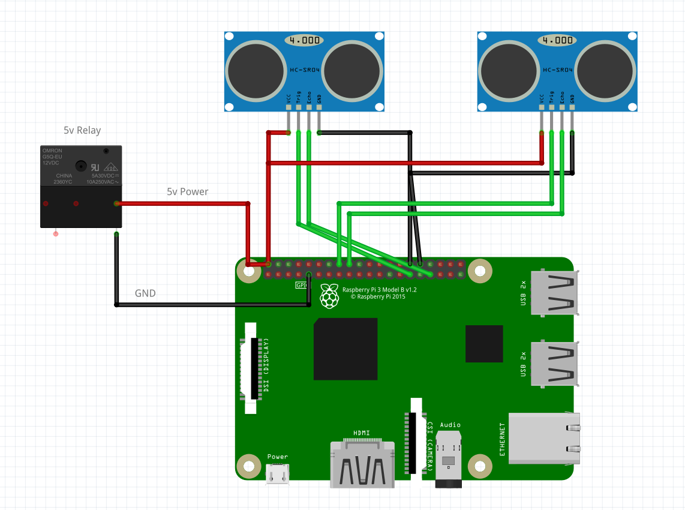

## Stairs
An RPi4 that triggers a Relay to power a custom 3W LED strip based on the distance of either Ultrasonic Sensor.

### 📦 Dependancies
- `golang`: Language of Choice, for buidling the application
- `github.com/stianeikeland/go-rpio`: Wrapper Library use the RPi's GPIO Pins

### 🚀 Build & Run
```shell
mkdir build                     # Build Directory (Optional but Cleaner)
go build -o build/app main.go   # Compile the Application
./app                           # Run the Binary (Might need Elevated Privelages: sudo)
```

### 🔗 Wiring
Schematic created using **Fritzing** and is available in the `docs` directory of this repo.
<p align="center">
  </img>
</p>

### ✈️ Future Plans
- Add an LCD Display running an Electron App for user interaction & data display
- Use accumulated data for a personal Machine Learning project involving gathered sensor data and LCD

### 📑 License
Licensed under the [MIT License](LICENSE).
